<div align="center">

<!-- LOGO / BANNER -->
  

<!-- BADGES -->


<br/>

> **Your Jarvis. In your browser. Free forever.**
>
> *POTTS is a voice-powered AI Chrome extension that watches, listens, judges, and explains*
> *everything on your screen — in real time, proactively, just like Jarvis from Iron Man.*

<br/>

<!-- STATS ROW -->


</div>

---

## 📋 Table of Contents

- [What is POTTS?](#-what-is-potts)
- [Feature Matrix — All 26 Features](#-feature-matrix--all-26-features)
- [How It Works](#-how-it-works)
- [Voice Commands](#-voice-commands)
- [Free API Stack](#-free-api-stack--zero-cost)
- [POTTS vs Jarvis — Persona Study](#-potts-vs-jarvis--persona-study)
- [File Structure](#-file-structure)
- [Installation](#-installation--5-steps)
- [Manifest Permissions](#-manifest-permissions)
- [Roadmap](#-roadmap)
- [Master Prompt](#-master-prompt)

---

## 🤖 What is POTTS?

**POTTS** (Personal Operations & Tactical Task System) is not a chatbot widget. It is a **proactive intelligence layer** over your entire browser. It doesn't wait to be asked — it watches what you're reading and speaks up when something matters.

```
"Analysis complete, Sir. This article contains 4 unverified claims
and 1 financial red flag. I would advise caution before sharing."
```

### Core Philosophy

| Principle | Description |
|-----------|-------------|
| 🎯 **Verdict-First** | Always gives a direct ✅ GOOD / ❌ BAD / ⚠️ CAUTION — never "it depends" |
| 🔒 **Privacy-First** | All data stays local. API calls only when you trigger them. Profile data PIN-encrypted |
| 🆓 **Free-Forever** | Built entirely on free-tier APIs and browser built-ins. Zero monthly cost |
| 🎙️ **Voice-First** | Wake word detection, always-on listening, tone-adaptive responses |
| ⚡ **Proactive** | Warns you before you click. Scans on page load. No manual triggering needed |

---

## 📊 Feature Matrix — All 26 Features

> 🔵 **JARVIS-CLASS** = Inspired by Iron Man's AI &nbsp;&nbsp; 🟡 **POTTS-ONLY** = Original advanced additions

### 🎙️ Layer 1 — Voice & Speech

| # | Feature | What It Does | Origin | Free API |
|---|---------|-------------|--------|----------|
| 01 | **Wake Word Detection** | Always-on "Hey Potts" background trigger. Plays chime on activation. Runs in offscreen document. | 🔵 JARVIS | Web Speech API |
| 02 | **Real-Time Speech-to-Text** | SpeechRecognition — live transcript, 40+ languages, push-to-talk + always-on modes | 🔵 JARVIS | SpeechRecognition API |
| 03 | **Neural Text-to-Speech** | Calm Jarvis-like voice via SpeechSynthesis. Adjustable rate, pitch. Natural sentence pausing | 🔵 JARVIS | SpeechSynthesis API |
| 04 | **Voice Tone Detection** | Web Audio API analyzes pitch + pace. Detects urgency → shorter responses. Calm voice → detailed answers | 🟡 POTTS | Web Audio API |

### 🧠 Layer 2 — Intelligence

| # | Feature | What It Does | Origin | Free API |
|---|---------|-------------|--------|----------|
| 05 | **Good / Bad Judgment Engine** | Rates anything on screen — products, articles, contracts, advice — as ✅ GOOD / ❌ BAD / ⚠️ CAUTION with 3-line reasoning | 🔵 JARVIS | Gemini 1.5 Flash |
| 06 | **Page Intelligence & Summary** | Full DOM extraction → TL;DR, key facts, tone, author credibility, reading time. Auto-triggers on page load | 🔵 JARVIS | Gemini 1.5 Flash |
| 07 | **Claim Fact-Checker** | Highlight any text → Wikipedia + Gemini cross-reference → Verified / Disputed / False with source | 🔵 JARVIS | Gemini + Wikipedia |
| 08 | **Deep Research Mode** | Multi-source synthesis: Gemini + Wikipedia + DuckDuckGo. Returns brief with pros, cons, confidence score 0–100 | 🔵 JARVIS | Gemini + Wikipedia + DDG |
| 09 | **Explain Anything (3 Levels)** | ELI5 / Normal / Expert explanation of any selection or page. Level switches by command | 🔵 JARVIS | Gemini 1.5 Flash |
| 10 | **Devil's Advocate Mode** | Argues strongest countercase against your current decision. Forces critical thinking before acting | 🟡 POTTS | Gemini 1.5 Flash |
| 11 | **Investment Risk Analyzer** | Detects guaranteed-return language, FOMO tactics, unregulated products, Ponzi signals. Rates Low/Med/High risk | 🟡 POTTS | Gemini 1.5 Flash |
| 12 | **Medical Claim Filter** | Auto-flags pseudoscience on health pages. Injects inline ⚠️ badge on non-evidence-based health claims | 🟡 POTTS | Gemini 1.5 Flash |

### 🛡️ Layer 3 — Security & Privacy

| # | Feature | What It Does | Origin | Free API |
|---|---------|-------------|--------|----------|
| 13 | **Proactive Scam Alerts** | Scans every page load for subscription traps, fake countdowns, dark UX patterns, phishing signals | 🔵 JARVIS | Gemini + Content Script |
| 14 | **Trust Score Engine** | 0–100 score using RDAP domain age + SSL + redirect chains + ad density heuristics | 🔵 JARVIS | RDAP (IANA) |
| 15 | **Privacy Guardian Mode** | EasyPrivacy-based tracker scan. Live count badge. Full report: tracker names, fingerprinters, pixel recorders | 🟡 POTTS | EasyPrivacy List |
| 16 | **Contract Red Flag Scanner** | Analyzes TOS/EULA for: auto-renew traps, data-selling clauses, arbitration waivers, hidden fee language | 🟡 POTTS | Gemini 1.5 Flash |

### ⚙️ Layer 4 — Automation

| # | Feature | What It Does | Origin | Free API |
|---|---------|-------------|--------|----------|
| 17 | **Voice Form Fill** | "Potts, fill my address" — fills forms from local PIN-encrypted profile. Never sent externally | 🔵 JARVIS | chrome.storage.local |
| 18 | **Smart Text Rewriter** | Focus any textarea → voice command → Gemini rewrites in-place. Works in Gmail, Notion, Twitter, LinkedIn | 🟡 POTTS | Gemini 1.5 Flash |
| 19 | **Code Review Mode** | MutationObserver detects code blocks. Auto-analyzes bugs, security issues, bad patterns. Works on GitHub, StackOverflow | 🟡 POTTS | Gemini 1.5 Flash |
| 20 | **Tab Monitor & Alerts** | Watches tabs for changes (price drops, article updates). Alerts via Chrome notifications | 🟡 POTTS | chrome.alarms |

### 💾 Layer 5 — Memory & Language

| # | Feature | What It Does | Origin | Free API |
|---|---------|-------------|--------|----------|
| 21 | **Session Memory** | Last 50 interactions stored with page context. "Potts, what did I look up earlier?" | 🔵 JARVIS | chrome.storage.session |
| 22 | **Cross-Tab Context** | Service worker tracks activity across all open tabs. Connects research across multiple pages | 🔵 JARVIS | chrome.tabs API |
| 23 | **Real-Time Translation** | MyMemory API — 50+ languages. Translates selection or full page. Optionally reads aloud | 🔵 JARVIS | MyMemory API |
| 24 | **Multilingual Voice Input** | Auto-detects language from your voice. Speak Hindi, Marathi, Tamil, Spanish — POTTS responds in same language | 🟡 POTTS | SpeechRecognition |

### 📋 Layer 6 — Productivity

| # | Feature | What It Does | Origin | Free API |
|---|---------|-------------|--------|----------|
| 25 | **Smart Clipboard Manager** | Logs every copy with page context + timestamp. Recall any past copy by voice | 🟡 POTTS | Clipboard API |
| 26 | **Daily Briefing Mode** | "Hey Potts, morning briefing" → 60-sec voice overview: top news + weather + tab summaries | 🔵 JARVIS | GNews + Open-Meteo |

---

## ⚙️ How It Works

```
┌─────────────────────────────────────────────────────────────────┐
│                        POTTS FLOW                               │
├─────────────────────────────────────────────────────────────────┤
│                                                                 │
│  1. BACKGROUND   →  Offscreen document listens for "Hey Potts"  │
│     SERVICE          chrome.offscreen API, zero CPU idle        │
│     WORKER                                                      │
│                                                                 │
│  2. WAKE WORD    →  Content script fires DOM extraction         │
│     DETECTED         Grabs visible text, trims to 3000 tokens   │
│                                                                 │
│  3. TONE         →  Web Audio API analyzes mic frequency data   │
│     ANALYSIS         High variance + fast pace = urgency flag   │
│     (parallel)       Shorter response if urgent, longer if calm │
│                                                                 │
│  4. INTENT       →  Local keyword classifier (no API call)      │
│     CLASSIFY         "good or bad" → Judgment Engine            │
│     (~5ms)           "go deep" → Research Mode                  │
│                      "verify" → Fact-Checker                    │
│                                                                 │
│  5. GEMINI API   →  System prompt + page context + memory       │
│     CALL             + tone flag + user command                 │
│     (2-4 sec)        Temperature: 0.3 | Max tokens: 500         │
│                                                                 │
│  6. RESPONSE     →  Text displayed in popup chat                │
│     DELIVERY         SpeechSynthesis reads it aloud             │
│                      Verdict badge injected into page DOM       │
│                      Interaction saved to session memory        │
│                                                                 │
└─────────────────────────────────────────────────────────────────┘
```

### Gemini API Call Pattern

```javascript
const GEMINI_URL = 'https://generativelanguage.googleapis.com/v1beta/models/gemini-1.5-flash:generateContent?key=YOUR_KEY';

async function askGemini(systemPrompt, userMessage) {
  const res = await fetch(GEMINI_URL, {
    method: 'POST',
    headers: { 'Content-Type': 'application/json' },
    body: JSON.stringify({
      contents: [{ parts: [{ text: systemPrompt + '\n\n' + userMessage }] }],
      generationConfig: { temperature: 0.3, maxOutputTokens: 500 }
    })
  });
  const data = await res.json();
  return data.candidates?.[0]?.content?.parts?.[0]?.text || 'No response.';
}
```

---

## 🎙️ Voice Commands

| Command | What POTTS Does |
|---------|----------------|
| `"Hey Potts, is this a scam?"` | Trust Score Engine — RDAP domain age, SSL, dark pattern scan → 0–100 trust score |
| `"Hey Potts, good or bad?"` | Instant Judgment Engine — always starts ✅ GOOD / ❌ BAD / ⚠️ CAUTION |
| `"Hey Potts, explain this"` | Explains selection or page. Add "simply" / "in detail" / "like an expert" to set level |
| `"Hey Potts, go deep"` | Deep Research Mode — 30–60 sec multi-source brief with confidence score |
| `"Hey Potts, devil's advocate"` | Argues strongest countercase against your current decision |
| `"Hey Potts, check the code"` | Scans visible code — bugs, security issues, plain English explanation |
| `"Hey Potts, privacy report"` | Full tracker scan — names, fingerprinters, pixel recorders. Rate: Clean/Moderate/Heavy |
| `"Hey Potts, translate this"` | Translates selection or page via MyMemory API. Reads aloud if wanted |
| `"Hey Potts, remember this"` | Saves current page / selection / fact to session memory |
| `"Hey Potts, verify this claim"` | Wikipedia + Gemini fact-check → Verified / Disputed / False with source |
| `"Hey Potts, morning briefing"` | 60-second voice overview: GNews headlines + Open-Meteo weather + tab summaries |
| `"Hey Potts, watch this tab"` | Adds tab to monitor list. Alerts on content change via chrome.notifications |
| `"Hey Potts, improve this text"` | Detects focused textarea → Gemini rewrites in-place |
| `"Hey Potts, fill my details"` | Fills form from local PIN-encrypted profile |
| `"Hey Potts, what did I copy?"` | Recalls clipboard history with page context + timestamp |

---

## 🆓 Free API Stack — Zero Cost

| API | Used For | Key Required | Quota |
|-----|----------|-------------|-------|
| [**Gemini 1.5 Flash**](https://aistudio.google.com/app/apikey) | AI brain — all judgments, research, summaries | ✅ Free key | 15 RPM · 1M tokens/day |
| [**Web Speech API**](https://developer.mozilla.org/en-US/docs/Web/API/Web_Speech_API) | STT + TTS — voice in and out | ❌ Browser built-in | Unlimited |
| [**Wikipedia REST API**](https://en.wikipedia.org/api/rest_v1/) | Fact-checking, deep research grounding | ❌ No key needed | Unlimited |
| [**MyMemory Translation**](https://mymemory.translated.net/doc/spec.php) | Real-time translation — 50+ languages | ❌ Optional email param | 5K–50K chars/day |
| [**Open-Meteo**](https://open-meteo.com/en/docs) | Weather for morning briefing | ❌ No key needed | 10K req/day |
| [**GNews API**](https://gnews.io/) | News headlines for morning briefing | ✅ Free key | 100 req/day |
| [**RDAP (IANA)**](https://rdap.org/) | Domain age for Trust Score Engine | ❌ No key needed | Unlimited |
| [**EasyPrivacy List**](https://easylist.to/) | Tracker detection for Privacy Guardian | ❌ Open source | Unlimited |
| [**DuckDuckGo Instant Answers**](https://api.duckduckgo.com/?q=test&format=json) | Research snippets + definitions | ❌ No key needed | Unlimited |
| [**Chrome Extension APIs**](https://developer.chrome.com/docs/extensions/reference/) | Storage, tabs, alarms, notifications, offscreen | ❌ Browser built-in | Unlimited |

> 💡 **Only 2 API keys needed:** Gemini 1.5 Flash (free at aistudio.google.com) + GNews (optional, only for morning briefing)

---

## 🎭 POTTS vs Jarvis — Persona Study

### Personality Rules (System Prompt Enforced)

```
You are POTTS (Personal Operations and Tactical Task System).

RULES YOU ALWAYS FOLLOW:
  ✦ Verdict first. Reasoning second. Always.
  ✦ Judgment responses MUST start: ✅ GOOD / ❌ BAD / ⚠️ CAUTION
  ✦ Max 150 words unless in Deep Research Mode
  ✦ Research always ends with: "Confidence: XX/100"
  ✦ Temperature 0.3 — confident, not creative
  ✦ When flagging danger: explain WHY + suggest what to do instead
  ✦ Never say "I don't know" → say "Insufficient data to form a verdict."
  ✦ Address user as "Sir" by default (configurable)
  ✦ Never hedge. Never say "it depends." Always commit to a verdict.
```

### Example Responses

**Scam Detection:**
```
User: "Hey Potts, is this safe?"

❌ BAD, Sir. Domain registered 18 days ago, SSL certificate is
self-signed, and I detect 3 dark-pattern UI elements including
a fake countdown timer. Classic phishing signature. Close this
tab immediately and clear your cache.
```

**Legitimate Source:**
```
User: "Potts, good or bad?"

✅ GOOD, Sir. Nature-indexed peer-reviewed article, impact
factor 41.5, published January 2025. Authors affiliated with
MIT, 800+ combined citations. All major claims are referenced.
You may proceed with confidence.
```

**Devil's Advocate:**
```
User: "Potts, argue against this"

Very well, Sir. Strongest case against: 3 unresolved BBB
complaints, warranty excludes water damage despite marketing
claims, and identical unit is ₹6,200 cheaper on Flipkart.
Confidence: 78/100.
```

---

## 📁 File Structure

```
potts-extension/
│
├── manifest.json                 # MV3 — permissions, service worker, popup
│
├── background/
│   └── service-worker.js         # Wake word · memory · tab monitor · alarms
│
├── content/
│   ├── content.js                # Injected to every page — DOM reader · overlay
│   ├── content.css               # Verdict badge styles · alert overlays
│   └── page-scanner.js           # Dark pattern · code block · med-claim detector
│
├── core/
│   ├── gemini.js                 # All Gemini API calls — single source of truth
│   ├── speech.js                 # STT + TTS · wake word · tone detection
│   ├── memory.js                 # Session memory · cross-tab context
│   ├── trust.js                  # Trust score — RDAP + SSL + heuristics
│   ├── privacy.js                # EasyPrivacy tracker scanner
│   ├── translate.js              # MyMemory translation wrapper
│   └── briefing.js               # Morning brief — news + weather + tab summaries
│
├── popup/
│   ├── popup.html                # Main extension UI — 380px Jarvis interface
│   ├── popup.css                 # Dark theme · cyan accent · voice animations
│   └── popup.js                  # Voice btn · chat · quick actions · settings
│
├── options/
│   ├── options.html              # Full settings page — API keys · profile · toggles
│   └── options.js                # Save to chrome.storage.local · PIN encrypt
│
├── assets/
│   ├── icon-16.png
│   ├── icon-48.png
│   ├── icon-128.png
│   └── chime.mp3                 # Wake word activation sound
│
└── rules.json                    # declarativeNetRequest — EasyPrivacy tracker blocking
```

---

## 🚀 Installation — 5 Steps

### Step 1 — Get Your Free Gemini API Key

```
https://aistudio.google.com/app/apikey
```
Sign in with any Google account → Create API Key → Done. Free. Instant.
Quota: **15 requests/min · 1,000,000 tokens/day · $0**

---

### Step 2 — Build POTTS with the Master Prompt

Copy the Master Prompt from this README (see below). Paste into **Claude Sonnet** or **Gemini**.

Say: `"build manifest.json"` → then `"next"` for each subsequent file.
All 13 files generated in order.

---

### Step 3 — Assemble the Folder

   ```bash
mkdir potts-extension
cd potts-extension
# Copy each generated file into its correct subfolder
# Add icon-128.png (any PNG works for testing)
```

---

### Step 4 — Load in Chrome

```
chrome://extensions  →  Developer Mode: ON  →  Load Unpacked  →  Select folder
```

POTTS icon appears in your Chrome toolbar.

---

### Step 5 — Enter Keys & Activate

1. Click POTTS icon → Settings
2. Paste your Gemini API key
3. Allow microphone permission
4. Say **"Hey Potts, are you online?"**
5. Hear: *"Online and ready, Sir."* ✅

---

## 🔐 Manifest Permissions

```json
{
  "manifest_version": 3,
  "name": "POTTS — AI Voice Assistant",
  "version": "2.4.0",
  "permissions": [
    "activeTab",
    "scripting",
    "storage",
    "tabs",
    "notifications",
    "alarms",
    "offscreen",
    "declarativeNetRequest"
  ],
  "host_permissions": ["<all_urls>"],
  "background": { "service_worker": "background/service-worker.js" },
  "action": { "default_popup": "popup/popup.html" },
  "content_scripts": [{
    "matches": ["<all_urls>"],
    "js": ["content/content.js"],
    "css": ["content/content.css"]
  }]
}
```

| Permission | Why Needed | Risk |
|-----------|-----------|------|
| `activeTab` | Read current tab DOM for page intelligence | 🟢 Low |
| `scripting` | Inject verdict overlays and form-fill | 🟡 Medium |
| `storage` | Save settings, API keys, session memory, profile | 🟢 Low |
| `tabs` | Cross-tab context awareness, tab monitoring | 🟡 Medium |
| `notifications` | Proactive scam alerts, tab change alerts | 🟢 Low |
| `alarms` | Tab monitor polling, daily briefing schedule | 🟢 Low |
| `offscreen` | Background audio for wake word detection | 🟢 Low |
| `declarativeNetRequest` | Block trackers using EasyPrivacy rules | 🟢 Low |

---

## 🗺️ Roadmap

### ✅ v2.4.0 — Current
- [x] All 26 core features
- [x] Gemini 1.5 Flash integration
- [x] Wake word detection
- [x] Session memory system
- [x] Privacy Guardian
- [x] Morning briefing mode

### 🔄 v3.0.0 — Coming Soon
- [ ] Persistent memory across browser sessions
- [ ] Image analysis via Gemini Vision (read screenshots)
- [ ] Custom wake word training
- [ ] Multi-tab research synthesis
- [ ] Firefox MV3 port

### 🔮 v4.0.0 — Future Vision
- [ ] Full viewport screen-reading mode
- [ ] Calendar + email integration
- [ ] Custom personas beyond Jarvis
- [ ] Local LLM mode via Ollama (fully offline)
- [ ] Team / shared POTTS profiles

 git clone https://github.com/codest0411/Potts-extension.git
   ```
2. **Enable Dev Mode**: Open Google Chrome and navigate to `chrome://extensions/`. Toggle **Developer Mode** on in the top-right corner.
3. **Load Extension**: Click the **Load unpacked** button and select the `Potts-extension` folder.
4. **Initial Configuration**: Right-click the newly appearing POTTS icon `◎` in your extension bar and select **Options**.
5. **Paste your API Keys**: Drop in your free Gemini, Groq, Anthropic, or OpenAI keys. Click **Save** and then **Verify API Keys** to ensure your link is active.
---

## 📝 Master Prompt

> Copy this into Claude or Gemini to generate the full extension. Use `"build manifest.json"` first, then `"next"` for each file.

<details>
<summary><strong>Click to expand Master Prompt</strong></summary>

```
###############################################
# POTTS — MASTER BUILD PROMPT
# Personal Operations & Tactical Task System
# Chrome Extension MV3 — Full Source Code
###############################################

## IDENTITY
You are a senior Chrome extension engineer. Build POTTS, a Manifest V3
Chrome extension that acts as a Jarvis-style AI voice assistant. POTTS
runs in the browser, listens for voice commands, analyzes web pages,
and gives Good/Bad judgments on anything the user is viewing.

## PERSONA
POTTS speaks like Jarvis from Iron Man:
- Calm, professional, slightly dry British tone
- Addresses user as "Sir" by default (configurable)
- Proactively warns — never just reacts
- Speaks in complete sentences, never fragments
- Confident — gives a direct verdict, never "it depends"
- Uses: "Analysis complete.", "I would advise caution.",
  "This appears legitimate.", "Red flag detected, Sir."

## TECH STACK
- Manifest Version: 3 (MV3)
- AI Engine: Google Gemini 1.5 Flash (free — key from aistudio.google.com)
- STT: Web Speech API / SpeechRecognition (browser built-in, free)
- TTS: Web Speech API / SpeechSynthesis (browser built-in, free)
- Translation: MyMemory API (free, no key for basic use)
- Weather: Open-Meteo API (free, no key)
- News: GNews API (free tier, 100 req/day)
- Domain Trust: RDAP (iana.org, free, no key)
- Privacy Lists: EasyPrivacy filter list (open source)
- Fact Check: Wikipedia REST API (free, no key)
- Search: DuckDuckGo Instant Answers API (free, no key)
- Storage: chrome.storage.local + chrome.storage.session
- UI: Vanilla HTML/CSS/JS — no React, no bundler needed

## REQUIRED FEATURES
VOICE LAYER:
1. Wake word "Hey Potts" — background listening via offscreen document
2. SpeechRecognition STT — push-to-talk + always-on modes
3. SpeechSynthesis TTS — Jarvis voice, adjustable rate/pitch
4. Tone detection via AudioContext — detect urgency from mic input

INTELLIGENCE LAYER:
5. Good/Bad Judgment Engine — rates any page content via Gemini
6. Page Intelligence — DOM extraction + Gemini summary + credibility
7. Claim Fact-Checker — highlight + verify via Wikipedia + Gemini
8. Deep Research Mode — multi-source synthesis with confidence score
9. Explain Anything — ELI5 / Normal / Expert levels
10. Devil's Advocate Mode — argues against user's current choice
11. Investment Risk Analyzer — detects financial red flags
12. Medical Claim Filter — flags pseudoscience on health pages

SECURITY LAYER:
13. Proactive Scam Alerts — dark pattern detection on page load
14. Trust Score Engine — RDAP + SSL + heuristics = 0-100 score
15. Privacy Guardian — EasyPrivacy tracker scan + report
16. Contract Red Flag Scanner — TOS dangerous clause detection

AUTOMATION LAYER:
17. Voice Form Fill — fill forms from local profile by voice
18. Smart Text Rewriter — improve/shorten/expand any textarea
19. Code Review Mode — detect code blocks + Gemini analysis
20. Tab Monitor — watch tabs for changes + notify

MEMORY LAYER:
21. Session Memory — last 50 interactions with page context
22. Cross-Tab Context — awareness across all open tabs

LANGUAGE LAYER:
23. Real-Time Translation — MyMemory API, 50+ languages
24. Multilingual Voice Input — auto-detect language

PRODUCTIVITY LAYER:
25. Smart Clipboard Manager — log copied text with page context
26. Daily Briefing Mode — 60s morning brief: news + weather + tabs

## POTTS SYSTEM PROMPT (inject into every Gemini call)
You are POTTS (Personal Operations and Tactical Task System),
a Jarvis-style AI assistant in a Chrome browser extension.

Rules you ALWAYS follow:
- Be direct. Give verdict first, reasoning second.
- For Good/Bad: always start "GOOD ✅", "BAD ❌", or "CAUTION ⚠️"
- For explanations: match requested level — Simple/Normal/Expert
- For research: give confidence score 0-100 at the end
- Keep responses under 150 words unless in Deep Research Mode
- Address user as "Sir" by default (configurable)
- Never say "I don't know" — say "Insufficient data to form a verdict."
- Flag danger proactively
- When something is BAD, explain WHY and suggest what to do instead
- Temperature 0.3 for consistent verdicts

## UI REQUIREMENTS
- Popup width: 380px, dark theme (#0a0c10 bg, #00dcff accent)
- Font: Outfit (Google Fonts) + Space Mono for code/verdicts
- Verdict badges: green/red/amber pill badges
- Voice button: pulsing ring animation when active
- Chat area: scrollable Jarvis-style message thread
- Quick actions: Analyze / Safety Check / Summarize / Research

## BUILD ORDER (one file at a time, wait for "next"):
1. manifest.json
2. background/service-worker.js
3. core/gemini.js
4. core/speech.js
5. core/memory.js
6. content/content.js + content/content.css
7. content/page-scanner.js
8. core/trust.js
9. core/privacy.js
10. core/translate.js
11. core/briefing.js
12. popup/popup.html + popup/popup.css + popup/popup.js
13. options/options.html + options/options.js
```

</details>

---

## 🔒 Security Rules

- ✅ API key stored in `chrome.storage.local` **only** — never hardcoded
- ✅ User profile data lives locally — **never sent to external servers**
- ✅ All external fetch calls route through **background service worker only**
- ✅ Strict Content Security Policy in manifest
- ✅ No `eval()`, no inline scripts in popup
- ✅ Profile data **PIN-encrypted** before storage

---

<div align="center">


**Built with [Gemini 1.5 Flash](https://aistudio.google.com/app/apikey) · Zero monthly cost · Your Jarvis, free forever**


</div>