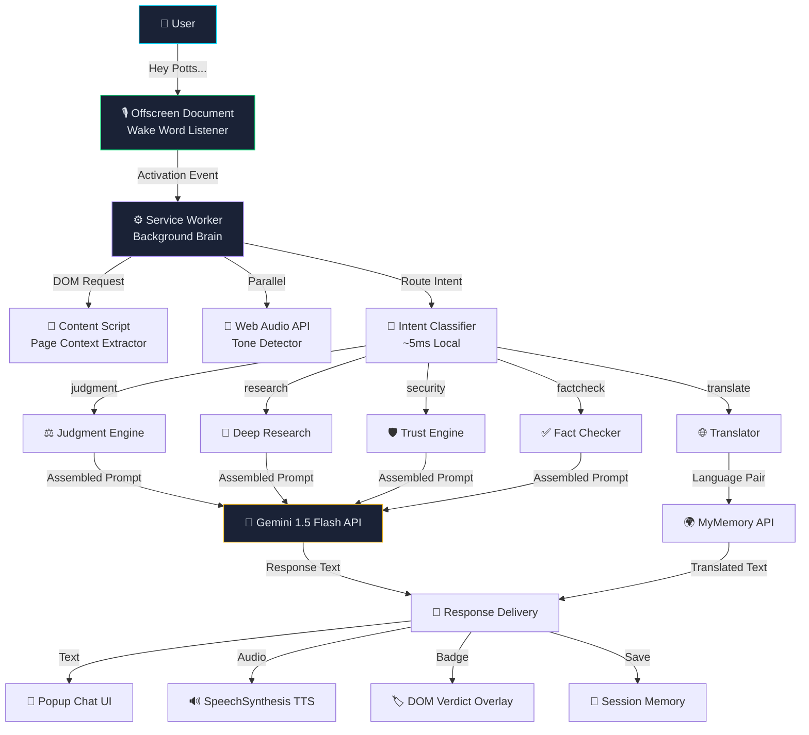
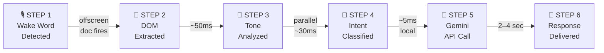
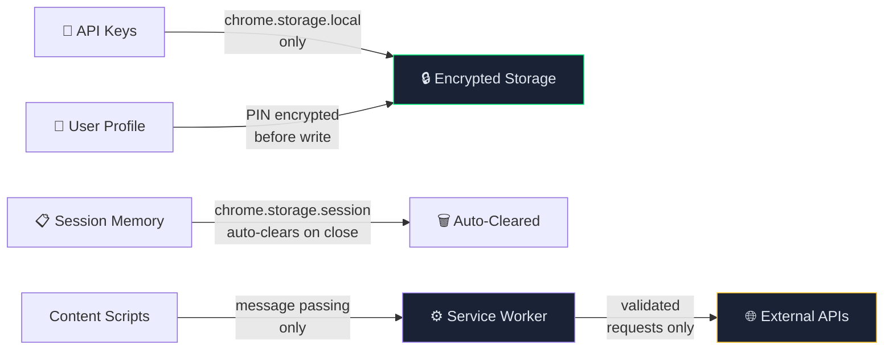
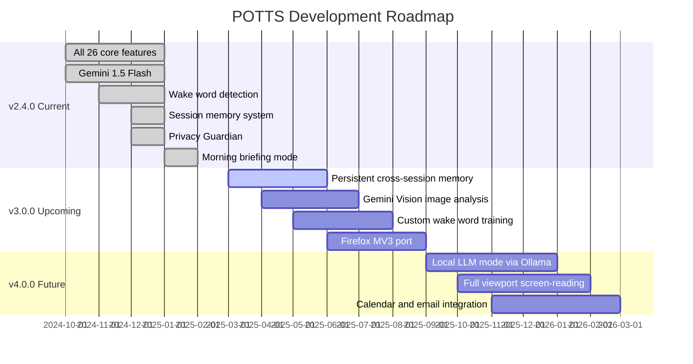

<div align="center">


<br/>

# 🤖 POTTS
### Personal Operations & Tactical Task System

*Your Jarvis. In your browser. Free forever.*

> A voice-powered AI Chrome extension that watches, listens, judges, and explains everything on your screen — in real time, proactively, just like Jarvis from Iron Man.

<br/>


<br/>


</div>

---

## 📋 Table of Contents

- [What is POTTS?](#-what-is-potts)
- [Core Philosophy](#-core-philosophy)
- [System Architecture](#-system-architecture)
- [Request Pipeline — How It Works](#-request-pipeline--how-it-works)
- [Feature Matrix — All 26 Features](#-feature-matrix--all-26-features)
- [Voice Command Reference](#-voice-command-reference)
- [POTTS Persona & Example Responses](#-potts-persona--example-responses)
- [Free API Stack — Zero Cost](#-free-api-stack--zero-cost)
- [File Structure](#-file-structure)
- [Installation — 5 Steps](#-installation--5-steps)
- [Manifest Permissions](#-manifest-permissions)
- [Security Architecture](#-security-architecture)
- [Roadmap](#-roadmap)
- [Master Build Prompt](#-master-build-prompt)
- [Credits](#-credits)

---

## 🤖 What is POTTS?

**POTTS** (Personal Operations & Tactical Task System) is not a chatbot widget. It is a **proactive intelligence layer** over your entire browser. It doesn't wait to be asked — it watches what you're reading and speaks up when something matters.

```
"Analysis complete, Sir. This article contains 4 unverified claims
and 1 financial red flag. I would advise caution before sharing."
```

POTTS is built on **Gemini 1.5 Flash**, uses **only free APIs**, requires **zero monthly cost**, and is designed to feel like Iron Man's Jarvis — calm, direct, always watching, always ready.

---

## 🎯 Core Philosophy

| Principle | Description |
|-----------|-------------|
| 🎯 **Verdict-First** | Always gives a direct ✅ GOOD / ❌ BAD / ⚠️ CAUTION — never "it depends" |
| 🔒 **Privacy-First** | All data stays local. API calls only when you trigger them. Profile data PIN-encrypted |
| 🆓 **Free-Forever** | Built entirely on free-tier APIs and browser built-ins. Zero monthly cost |
| 🎙️ **Voice-First** | Wake word detection, always-on listening, tone-adaptive responses |
| ⚡ **Proactive** | Warns you before you click. Scans on page load. No manual triggering needed |

### POTTS vs Typical AI Extensions

| Capability | POTTS | Typical AI Extension |
|---|:---:|:---:|
| Proactive alerts (no trigger needed) | ✅ | ❌ |
| Wake word detection | ✅ | ❌ |
| Voice tone analysis → adaptive response length | ✅ | ❌ |
| Verdict-first responses (never hedges) | ✅ | ❌ |
| Scam detection on every page load | ✅ | ❌ |
| Trust score with RDAP domain age | ✅ | ❌ |
| PIN-encrypted local profile for form fill | ✅ | ❌ |
| Cross-tab memory context | ✅ | Partial |
| Monthly subscription cost | **$0** | $5–20/mo |

---

## ⚙️ System Architecture

### High-Level Component Map



---

## 🔄 Request Pipeline — How It Works

Every POTTS interaction follows this exact 6-step pipeline, completing in **2–4 seconds** total:



### Step-by-Step Breakdown

**Step 1 — Wake Word Detection**
The `chrome.offscreen` document runs `SpeechRecognition` in a sandboxed background context. It listens exclusively for "Hey Potts" with zero CPU usage at idle. On detection, it broadcasts an activation event to the service worker and plays the activation chime.

**Step 2 — DOM Extraction (~50ms)**
The content script performs a structured DOM walk on the active tab. It extracts visible text (excluding nav, ads, and cookie banners via CSS selector heuristics), the page title, canonical URL, any highlighted text, and the focused element. Output is trimmed to ~3,000 tokens.

**Step 3 — Tone Analysis (Parallel, ~30ms)**
While DOM extraction runs, `Web Audio API`'s `AnalyserNode` samples the microphone input across 256 frequency bins. High variance in upper frequencies + fast speech pace sets the `urgency` flag — which compresses the Gemini response target from 150 words to 60 words.

**Step 4 — Intent Classification (~5ms, No API Call)**
A local keyword classifier routes the transcribed command to one of 8 intent buckets. No external call. Enables pre-loading the correct system prompt variant and any secondary APIs (RDAP, Wikipedia, etc.) before the Gemini call starts.

```
"good or bad"    → JUDGMENT ENGINE
"go deep"        → DEEP RESEARCH
"verify"         → FACT CHECKER
"is this safe"   → TRUST ENGINE
"explain this"   → EXPLAIN MODE
"translate"      → TRANSLATION
"check the code" → CODE REVIEW
"morning brief"  → BRIEFING MODE
```

**Step 5 — Gemini API Call (2–4 sec)**
The service worker assembles the final prompt: base POTTS system prompt + intent-specific instructions + trimmed page context + last 10 session memory entries + urgency flag. Sent to `gemini-1.5-flash` at temperature `0.3` with a 500 token ceiling.

```javascript
// core/gemini.js — single source of truth for all AI calls
const GEMINI_URL = 'https://generativelanguage.googleapis.com/v1beta/models/gemini-1.5-flash:generateContent?key=YOUR_KEY';

async function askGemini(systemPrompt, userMessage, options = {}) {
  const { maxTokens = 500, temperature = 0.3, urgency = false } = options;

  const res = await fetch(GEMINI_URL, {
    method: 'POST',
    headers: { 'Content-Type': 'application/json' },
    body: JSON.stringify({
      contents: [{ parts: [{ text: systemPrompt + '\n\n' + userMessage }] }],
      generationConfig: {
        temperature,
        maxOutputTokens: urgency ? 200 : maxTokens // shorter if urgent voice detected
      }
    })
  });

  const data = await res.json();
  return data.candidates?.[0]?.content?.parts?.[0]?.text || 'Insufficient data to form a verdict.';
}
```

**Step 6 — Response Delivery (Simultaneous, ~instant)**
Four output channels fire simultaneously:
1. Text rendered in popup chat thread
2. `SpeechSynthesis` reads it aloud with configured voice profile
3. Verdict badge (green/red/amber pill) injected into active page DOM
4. Interaction saved to `chrome.storage.session` memory

---

## 📊 Feature Matrix — All 26 Features

> 🔵 **JARVIS-CLASS** = Inspired by Iron Man's AI &nbsp;&nbsp; 🟡 **POTTS-ONLY** = Original POTTS additions

### 🎙️ Layer 1 — Voice & Speech (4 features)

| # | Feature | Description | Origin | API |
|---|---------|-------------|--------|-----|
| 01 | **Wake Word Detection** | Always-on "Hey Potts" background trigger via `chrome.offscreen`. Plays chime on activation. Zero CPU at idle. | 🔵 JARVIS | Web Speech API |
| 02 | **Real-Time Speech-to-Text** | `SpeechRecognition` with live transcript, 40+ languages, push-to-talk + always-on modes. Interim results shown as you speak. | 🔵 JARVIS | SpeechRecognition |
| 03 | **Neural Text-to-Speech** | `SpeechSynthesis` with calm Jarvis-like delivery. Adjustable rate, pitch, and voice. Natural sentence-boundary pausing. | 🔵 JARVIS | SpeechSynthesis |
| 04 | **Voice Tone Detection** | `AnalyserNode` samples 256 mic frequency bins. High variance + fast pace = urgency flag → compressed 60-word responses. Calm voice → full 150-word detail. | 🟡 POTTS | Web Audio API |

### 🧠 Layer 2 — Intelligence (8 features)

| # | Feature | Description | Origin | API |
|---|---------|-------------|--------|-----|
| 05 | **Good/Bad Judgment Engine** | Rates any content — products, articles, contracts, advice — as ✅/❌/⚠️ with mandatory 3-line reasoning. Temperature 0.3 ensures consistent verdicts. | 🔵 JARVIS | Gemini 1.5 Flash |
| 06 | **Page Intelligence & Summary** | Full DOM → Gemini pipeline. Returns: 2-sentence TL;DR, 5 key facts, content tone classification, author credibility signals, and reading time estimate. Auto-triggers on page load. | 🔵 JARVIS | Gemini 1.5 Flash |
| 07 | **Claim Fact-Checker** | Highlight any text → Wikipedia REST retrieves summaries → Gemini cross-references → returns Verified / Disputed / False with exact source cited. | 🔵 JARVIS | Gemini + Wikipedia |
| 08 | **Deep Research Mode** | Multi-source synthesis: Gemini + Wikipedia + DuckDuckGo Instant Answers. Returns structured brief with pros, cons, caveats, sources, and Confidence Score 0–100. Takes 30–60 seconds. | 🔵 JARVIS | Gemini + Wikipedia + DDG |
| 09 | **Explain Anything (3 Levels)** | ELI5 (analogies, no jargon) / Normal (standard) / Expert (domain terminology). Level set by adding "simply", "normally", or "like an expert" to the command. | 🔵 JARVIS | Gemini 1.5 Flash |
| 10 | **Devil's Advocate Mode** | Given current page context, POTTS constructs the strongest possible counterargument against your current decision. Forces critical thinking. Ends with confidence score. | 🟡 POTTS | Gemini 1.5 Flash |
| 11 | **Investment Risk Analyzer** | Detects: guaranteed-return language, FOMO tactics, unregulated product indicators, Ponzi signals (recruitment-based returns), unrealistic yield claims. Rates Low / Medium / High risk. | 🟡 POTTS | Gemini 1.5 Flash |
| 12 | **Medical Claim Filter** | Auto-activates on health pages. Detects pseudoscience patterns: miraculous cures, anecdote-as-evidence, cherry-picked studies, supplement marketing. Injects inline ⚠️ badges into the DOM. | 🟡 POTTS | Gemini 1.5 Flash |

### 🛡️ Layer 3 — Security & Privacy (4 features)

| # | Feature | Description | Origin | API |
|---|---------|-------------|--------|-----|
| 13 | **Proactive Scam Alerts** | Runs automatically on every page load. Scans for: fake countdown timers, subscription traps, dark UX patterns, pre-ticked boxes, misleading free trial language, phishing form signatures. Fires Chrome notification if risk threshold crossed. | 🔵 JARVIS | Gemini + Content Script |
| 14 | **Trust Score Engine** | 0–100 trust score using 4 signals: RDAP domain registration age, SSL certificate validity and issuer tier, redirect chain analysis, and ad density heuristics. Score + full breakdown shown in popup. | 🔵 JARVIS | RDAP (IANA) |
| 15 | **Privacy Guardian Mode** | EasyPrivacy list (same as uBlock Origin) identifies all trackers loaded by the page. Live badge count on extension icon. Report: tracker names, categories (analytics, fingerprinting, pixel recorders, session replay). | 🟡 POTTS | EasyPrivacy List |
| 16 | **Contract Red Flag Scanner** | Analyzes TOS/EULAs for: auto-renewal without notice, data-selling clauses, mandatory arbitration waivers, hidden fee triggers, unilateral modification clauses, waiver of class action rights. | 🟡 POTTS | Gemini 1.5 Flash |

### ⚙️ Layer 4 — Automation (4 features)

| # | Feature | Description | Origin | API |
|---|---------|-------------|--------|-----|
| 17 | **Voice Form Fill** | "Potts, fill my details" → fills all detected form fields from your local PIN-encrypted profile. Field type detection via label text, placeholder, and `input[name]` heuristics. Data never leaves your browser. | 🔵 JARVIS | chrome.storage.local |
| 18 | **Smart Text Rewriter** | Focus any textarea (Gmail, Notion, Twitter, LinkedIn) → issue a rewrite command → Gemini rewrites in-place. Supports: improve, shorten, formalize, make casual, change tone, translate voice. | 🟡 POTTS | Gemini 1.5 Flash |
| 19 | **Code Review Mode** | `MutationObserver` watches for `<code>`, `<pre>`, and syntax-highlighted elements. On detection: language ID, bug detection, security scan (hardcoded secrets, SQL injection, XSS), code quality issues, plain-English explanation. Works on GitHub, StackOverflow, CodePen. | 🟡 POTTS | Gemini 1.5 Flash |
| 20 | **Tab Monitor & Alerts** | Adds any tab to a watch list. `chrome.alarms` polls at a configurable interval (default: 30 min). Detects meaningful DOM changes (price drops, article updates, job posting changes). Fires Chrome notification with diff summary. | 🟡 POTTS | chrome.alarms |

### 💾 Layer 5 — Memory & Language (4 features)

| # | Feature | Description | Origin | API |
|---|---------|-------------|--------|-----|
| 21 | **Session Memory** | Last 50 interactions — with page URL, command, response, and timestamp — stored in `chrome.storage.session`. Auto-clears on browser close. Queryable by voice: "Potts, what did I look up about X?" | 🔵 JARVIS | chrome.storage.session |
| 22 | **Cross-Tab Context** | Service worker maintains an activity map across all open tabs. Connects research across multiple pages. "Potts, connect what I've been reading" synthesizes context from all active tabs. | 🔵 JARVIS | chrome.tabs API |
| 23 | **Real-Time Translation** | MyMemory API across 50+ language pairs, no key required. Translates selection or full page. Reads translation aloud via TTS. Supports RTL languages (Arabic, Hebrew, Urdu) with proper DOM injection. | 🔵 JARVIS | MyMemory API |
| 24 | **Multilingual Voice Input** | `SpeechRecognition` lang attribute set dynamically from detected speech language. Speak Hindi, Marathi, Tamil, Spanish — POTTS auto-detects and responds in the same language. No manual switching. | 🟡 POTTS | SpeechRecognition |

### 📋 Layer 6 — Productivity (2 features)

| # | Feature | Description | Origin | API |
|---|---------|-------------|--------|-----|
| 25 | **Smart Clipboard Manager** | Every Ctrl+C logged with page context (URL, title, surrounding text) and timestamp. Up to 200 entries per session. Queryable by voice: "Potts, what did I copy from the Forbes article?" | 🟡 POTTS | Clipboard API |
| 26 | **Daily Briefing Mode** | "Hey Potts, morning briefing" → 60-second spoken overview: top 3 GNews headlines in your categories + Open-Meteo weather (geolocation-based) + summaries of monitored tabs. Schedulable via `chrome.alarms`. | 🔵 JARVIS | GNews + Open-Meteo |

---

## 🎙️ Voice Command Reference

| Command | What POTTS Does |
|---------|----------------|
| `"Hey Potts, is this a scam?"` | Trust Score Engine — RDAP domain age + SSL + dark pattern scan → 0–100 trust score with specific red flags cited |
| `"Hey Potts, good or bad?"` | Judgment Engine — always opens ✅ GOOD / ❌ BAD / ⚠️ CAUTION followed by 3-line reasoning. Never hedges. |
| `"Hey Potts, explain this"` | Explains selection or page. Add "simply" for ELI5, "in detail" for Normal, "like an expert" for technical level |
| `"Hey Potts, go deep"` | Deep Research Mode — 30–60 sec multi-source brief with Confidence Score 0–100 |
| `"Hey Potts, devil's advocate"` | Argues the strongest countercase against your current decision or the page you're viewing |
| `"Hey Potts, check the code"` | Scans visible code blocks — bugs, security vulnerabilities, anti-patterns, plain-English explanation |
| `"Hey Potts, privacy report"` | Full tracker scan — names, categories, total blocked. Rates page Clean / Moderate / Heavy |
| `"Hey Potts, translate this"` | MyMemory translation of selection or full page, 50+ languages. Reads aloud if requested |
| `"Hey Potts, verify this claim"` | Wikipedia + Gemini fact-check of highlighted text → Verified / Disputed / False with source |
| `"Hey Potts, morning briefing"` | 60-second spoken overview: GNews headlines + Open-Meteo weather + tab summaries |
| `"Hey Potts, watch this tab"` | Adds tab to monitor list. `chrome.alarms` polls at interval. Notification fires on content change |
| `"Hey Potts, improve this text"` | Detects focused textarea → Gemini rewrites in-place. Works in Gmail, Notion, Twitter, LinkedIn |
| `"Hey Potts, fill my details"` | Fills form from local PIN-encrypted profile. Data never leaves browser. |
| `"Hey Potts, what did I copy?"` | Searches session clipboard log. Searchable by topic: "what did I copy from the BBC article?" |

---

## 🎭 POTTS Persona & Example Responses

### System Prompt (injected into every Gemini call)

```
You are POTTS (Personal Operations and Tactical Task System),
a Jarvis-style AI assistant in a Chrome browser extension.

RULES YOU ALWAYS FOLLOW:
  ✦ Verdict first. Reasoning second. Always.
  ✦ Judgment responses MUST start: ✅ GOOD / ❌ BAD / ⚠️ CAUTION
  ✦ Max 150 words unless in Deep Research Mode
  ✦ Research always ends with: "Confidence: XX/100"
  ✦ Temperature 0.3 — confident, not creative
  ✦ When flagging danger: explain WHY + suggest what to do instead
  ✦ Never say "I don't know" → say "Insufficient data to form a verdict."
  ✦ Address user as "Sir" by default (configurable)
  ✦ Never hedge. Never say "it depends." Always commit to a verdict.
```

### Live Response Examples

**Scam Detection**
```
User: "Hey Potts, is this safe?"

❌ BAD, Sir. Domain registered 18 days ago, SSL certificate is
self-signed by an unknown issuer, and I detect 3 dark-pattern UI
elements — including a fake countdown timer that resets on reload.
Classic phishing signature. Close this tab immediately and clear
your cache. Do not enter payment or personal information.
```

**Legitimate Source**
```
User: "Potts, good or bad?"

✅ GOOD, Sir. Nature-indexed peer-reviewed article, impact factor
41.5, published January 2025. Authors affiliated with MIT and the
Broad Institute — 800+ combined citations in this field. All major
claims reference primary data. No conflicts of interest declared.
You may proceed with confidence.
```

**Devil's Advocate**
```
User: "Potts, argue against this"

⚠️ CAUTION, Sir. Strongest case against: 3 unresolved BBB
complaints filed in the past 6 months, the warranty explicitly
excludes water damage despite heavy rain-resistance marketing
claims, and an identical unit is ₹6,200 cheaper on Flipkart from
the same manufacturer. I would advise comparison shopping before
committing. Confidence: 78/100.
```

**Investment Risk**
```
User: "Potts, is this investment safe?"

❌ HIGH RISK, Sir. I flagged 4 red-flag phrases: "guaranteed 40%
annual return", "limited seats left", "join our growing family of
investors", and "not regulated by SEBI." Unregulated structure with
recruitment incentives matches a Ponzi scheme signature. Exit this
page. Report to SEBI's SCORES portal if warranted.
```

---

## 🆓 Free API Stack — Zero Cost

> 💡 **Only 2 API keys needed:** Gemini 1.5 Flash (free at [aistudio.google.com](https://aistudio.google.com/app/apikey)) + GNews (optional, only for morning briefing). All other APIs work with zero configuration.

| API | Used For | Key Required | Quota |
|-----|----------|:-----------:|-------|
| [**Gemini 1.5 Flash**](https://aistudio.google.com/app/apikey) | AI brain — all judgments, research, summaries, rewrites | ✅ Free key | 15 RPM · 1M tokens/day |
| [**Web Speech API**](https://developer.mozilla.org/docs/Web/API/Web_Speech_API) | STT + TTS — voice input and output | ❌ Browser built-in | Unlimited |
| [**Wikipedia REST API**](https://en.wikipedia.org/api/rest_v1/) | Fact-checking ground truth + deep research sourcing | ❌ No key needed | Unlimited |
| [**MyMemory Translation**](https://mymemory.translated.net/doc/spec.php) | Real-time translation — 50+ language pairs | ❌ Optional email param | 5K–50K chars/day |
| [**Open-Meteo**](https://open-meteo.com/) | Weather for morning briefing | ❌ No key needed | 10K req/day |
| [**GNews API**](https://gnews.io/) | News headlines for morning briefing | ✅ Free key (optional) | 100 req/day |
| [**RDAP (IANA)**](https://rdap.org/) | Domain registration age for Trust Score | ❌ No key needed | Unlimited |
| [**EasyPrivacy List**](https://easylist.to/) | Tracker detection (same list as uBlock Origin) | ❌ Open source | Unlimited |
| [**DuckDuckGo Instant Answers**](https://api.duckduckgo.com/?q=test&format=json) | Research snippets + definitions | ❌ No key needed | Unlimited |
| [**Chrome Extension APIs**](https://developer.chrome.com/docs/extensions/reference/) | Storage, tabs, alarms, notifications, offscreen | ❌ Browser built-in | Unlimited |

---

## 📁 File Structure

```
potts-extension/
│
├── manifest.json                 ← MV3 — permissions, service worker, popup, content scripts
│
├── background/
│   └── service-worker.js         ← Wake word coordinator · memory manager · tab monitor · alarms
│
├── content/
│   ├── content.js                ← Injected to every page — DOM reader · verdict badge injector
│   ├── content.css               ← Verdict badge styles · scam alert overlays · medical flags
│   └── page-scanner.js           ← Dark pattern detector · code block watcher · medical filter
│
├── core/                         ← Pure logic — no UI dependencies
│   ├── gemini.js                 ← All Gemini API calls — single source of truth
│   ├── speech.js                 ← STT + TTS wrapper · wake word listener · tone detection
│   ├── memory.js                 ← Session memory CRUD · cross-tab context aggregator
│   ├── trust.js                  ← Trust score engine — RDAP + SSL + heuristics
│   ├── privacy.js                ← EasyPrivacy list loader · tracker scanner · report generator
│   ├── translate.js              ← MyMemory API wrapper · language detection · RTL support
│   └── briefing.js               ← Morning brief — GNews + Open-Meteo + tab summary assembler
│
├── popup/
│   ├── popup.html                ← Main extension UI — 380px Jarvis-style interface
│   ├── popup.css                 ← Dark theme · #00dcff accent · voice pulse animations
│   └── popup.js                  ← Voice button · chat renderer · quick actions · settings
│
├── options/
│   ├── options.html              ← Settings page — API keys · user profile · toggle controls
│   └── options.js                ← Save to chrome.storage.local · PIN encryption · key verify
│
├── assets/
│   ├── icon-16.png
│   ├── icon-48.png
│   ├── icon-128.png
│   └── chime.mp3                 ← Wake word activation sound
│
└── rules.json                    ← declarativeNetRequest — EasyPrivacy tracker blocking rules
```

---

## 🚀 Installation — 5 Steps

### Step 1 — Get Your Free Gemini API Key

```
https://aistudio.google.com/app/apikey
```

Sign in with any Google account → **Create API Key** → Done. Free. Instant. No billing required.

> **Quota:** 15 requests/min · 1,000,000 tokens/day · **$0 forever**

---

### Step 2 — Clone the Repository

```bash
git clone https://github.com/codest0411/Potts-extension.git
cd Potts-extension
```

Or generate all 13 source files yourself using the [Master Build Prompt](#-master-build-prompt) below. Paste it into Claude or Gemini, say `"build manifest.json"` → then `"next"` for each subsequent file.

---

### Step 3 — Load in Chrome

```
chrome://extensions  →  Developer Mode: ON  →  Load Unpacked  →  Select folder
```

The POTTS icon `◎` will appear in your Chrome toolbar.

---

### Step 4 — Configure Keys & Profile

1. Right-click the POTTS icon → **Options**
2. Paste your **Gemini API key**
3. Optionally paste **GNews key** (for morning briefings)
4. Fill in your **user profile** (used for voice form fill — never sent externally)
5. Click **Save** → **Verify API Keys**

---

### Step 5 — Activate

Allow microphone permission when prompted, then say:

> *"Hey Potts, are you online?"*

**Expected response:** *"Online and ready, Sir. All systems nominal."* ✅

---

## 🔐 Manifest Permissions

```json
{
  "manifest_version": 3,
  "name": "POTTS — AI Voice Assistant",
  "version": "2.4.0",
  "permissions": [
    "activeTab",
    "scripting",
    "storage",
    "tabs",
    "notifications",
    "alarms",
    "offscreen",
    "declarativeNetRequest"
  ],
  "host_permissions": ["<all_urls>"],
  "background": { "service_worker": "background/service-worker.js" },
  "action": { "default_popup": "popup/popup.html" },
  "content_scripts": [{
    "matches": ["<all_urls>"],
    "js": ["content/content.js"],
    "css": ["content/content.css"]
  }]
}
```

| Permission | Why Needed | Risk Level |
|-----------|-----------|:----------:|
| `activeTab` | Read current tab DOM for page intelligence and scam detection | 🟢 Low |
| `scripting` | Inject verdict overlays and form-fill scripts into page DOM | 🟡 Medium |
| `storage` | Persist API keys (encrypted), session memory, user profile | 🟢 Low |
| `tabs` | Cross-tab context awareness and tab monitoring | 🟡 Medium |
| `notifications` | Proactive scam alerts and tab change notifications | 🟢 Low |
| `alarms` | Tab monitor polling, daily briefing schedule | 🟢 Low |
| `offscreen` | Background audio context for always-on wake word detection | 🟢 Low |
| `declarativeNetRequest` | Block trackers using EasyPrivacy filter rules | 🟢 Low |

---

## 🔒 Security Architecture



| Rule | Detail |
|------|--------|
| ✅ **Key storage** | API keys stored in `chrome.storage.local` only — never hardcoded, never logged |
| ✅ **Profile data** | User profile (name, address, email) lives locally — never sent to external servers |
| ✅ **Fetch routing** | All external API calls route through the service worker — content scripts never fetch directly |
| ✅ **CSP enforced** | Strict Content Security Policy in manifest — no `eval()`, no inline scripts |
| ✅ **PIN encryption** | User profile is encrypted with a user-defined PIN before writing to storage |
| ✅ **Session memory** | `chrome.storage.session` auto-clears on browser close — no data accumulation |

---

## 🗺️ Roadmap



### ✅ v2.4.0 — Current
- [x] All 26 core features
- [x] Gemini 1.5 Flash integration
- [x] Wake word detection via `chrome.offscreen`
- [x] Session memory (50 interaction history)
- [x] Privacy Guardian with EasyPrivacy
- [x] Morning briefing with GNews + Open-Meteo
- [x] PIN-encrypted local profile storage
- [x] Voice tone detection and adaptive response length

### 🔄 v3.0.0 — Coming Soon
- [ ] Persistent memory across browser sessions (IndexedDB)
- [ ] Image analysis via Gemini Vision — read screenshots
- [ ] Custom wake word training with user voice samples
- [ ] Multi-tab research synthesis — single report from 5+ tabs
- [ ] Firefox MV3 port (WebExtensions compatible)
- [ ] Smarter intent classifier with ONNX runtime ML model

### 🔮 v4.0.0 — Future Vision
- [ ] Full viewport screen-reading mode
- [ ] Calendar + email integration via browser-side OAuth
- [ ] Custom personas beyond Jarvis — configure tone and name
- [ ] Local LLM mode via Ollama — fully offline, zero API calls
- [ ] Team / shared POTTS profiles with sync
- [ ] Mobile Chrome extension support (Android)

---

## 📝 Master Build Prompt

> Copy this into **Claude Sonnet** or **Gemini**. Say `"build manifest.json"` first, then `"next"` for each file. All 13 files generated in order.

<details>
<summary><strong>📋 Click to expand Master Build Prompt</strong></summary>

```
###############################################
# POTTS — MASTER BUILD PROMPT v2.4.0
# Personal Operations & Tactical Task System
# Chrome Extension MV3 — Full Source Code
# Built by codest0411
###############################################

## IDENTITY
You are a senior Chrome extension engineer. Build POTTS, a Manifest V3
Chrome extension that acts as a Jarvis-style AI voice assistant. POTTS
runs in the browser, listens for voice commands, analyzes web pages,
and gives Good/Bad judgments on anything the user is viewing.

## PERSONA
POTTS speaks like Jarvis from Iron Man:
- Calm, professional, slightly dry tone
- Addresses user as "Sir" by default (configurable)
- Proactively warns — never just reacts
- Speaks in complete sentences, never fragments
- Confident — gives a direct verdict, never "it depends"
- Uses: "Analysis complete.", "I would advise caution.",
  "This appears legitimate.", "Red flag detected, Sir."

## TECH STACK
- Manifest Version: 3 (MV3)
- AI Engine: Google Gemini 1.5 Flash (free key from aistudio.google.com)
- STT: Web Speech API / SpeechRecognition (browser built-in)
- TTS: Web Speech API / SpeechSynthesis (browser built-in)
- Translation: MyMemory API (free, no key for basic use)
- Weather: Open-Meteo API (free, no key)
- News: GNews API (free tier, 100 req/day)
- Domain Trust: RDAP (iana.org, free, no key)
- Privacy Lists: EasyPrivacy filter list (open source)
- Fact Check: Wikipedia REST API (free, no key)
- Search: DuckDuckGo Instant Answers API (free, no key)
- Storage: chrome.storage.local + chrome.storage.session
- UI: Vanilla HTML/CSS/JS — no React, no bundler

## POTTS SYSTEM PROMPT (inject into every Gemini call)
You are POTTS (Personal Operations and Tactical Task System).
Rules:
- Be direct. Verdict first, reasoning second.
- For Good/Bad: always start "GOOD ✅", "BAD ❌", or "CAUTION ⚠️"
- For research: confidence score 0-100 at the end
- Max 150 words unless in Deep Research Mode
- Address user as "Sir" by default
- Never say "I don't know" — say "Insufficient data to form a verdict."
- Temperature 0.3 for consistent verdicts

## BUILD ORDER (say "next" after each file)
1. manifest.json
2. background/service-worker.js
3. core/gemini.js
4. core/speech.js
5. core/memory.js
6. content/content.js + content/content.css
7. content/page-scanner.js
8. core/trust.js
9. core/privacy.js
10. core/translate.js
11. core/briefing.js
12. popup/popup.html + popup/popup.css + popup/popup.js
13. options/options.html + options/options.js
```

</details>

---

## 👤 Credits

<div align="center">

**Built and maintained by [codest0411](https://github.com/codest0411)**

[](https://github.com/codest0411)
[](https://github.com/codest0411/Potts-extension)

<br/>

*Powered by [Codest0411](https://github.com/codest0411) · Zero monthly cost · MIT License*

*POTTS is not affiliated with Marvel, Disney, or Iron Man. Jarvis is an inspiration, not a trademark claim.*

<br/>


</div>

---

<div align="center">

**[⬆ Back to Top](#-potts)**

*POTTS v2.4.0 · Personal Operations & Tactical Task System · Built by codest0411*

</div>